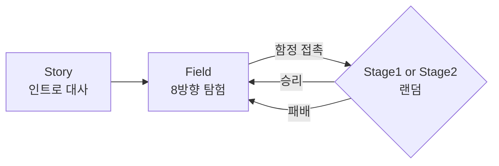

# 01. 프로젝트 개요

## 게임 소개

TURNORI는 2D 쿼터뷰(아이소메트릭) 필드를 돌아다니다가 함정에 접촉하면 턴제 전투로 진입하는
클래식 JRPG 구조의 프로토타입입니다. 플레이어는 **검사 / 신관 / 마법사** 3인 파티를 조작해
몬스터 3마리와 싸웁니다.

스토리는 `Assets/Resources/story.txt`에 담겨 있습니다. 인간과 용족의 평화를 상징하는 물건이
사라져 전쟁 재발 조짐이 보이고, 주인공들(로사·네오)이 그 물건을 찾아 왕국으로 향한다는 설정입니다.

## 플레이 루프



1. **Story** — 클릭으로 대사를 넘기며 `story.txt`의 7줄을 소비. 마지막 클릭 시 `Field`로 전환
2. **Field** — 마녀 캐릭터를 방향키로 조작. 맵에 4개의 `TrapSpawn`이 각각 전투 트리거 3개를 뿌림
3. **Stage1 / Stage2** — 턴제 전투. 전멸하거나 전멸시키면 결과 캔버스가 뜨고 버튼으로 `Field` 복귀

필드 복귀 시 위치는 `PlayerPrefs`의 `PlayerX` / `PlayerY`로 복원됩니다
(전투에 진입한 트리거의 좌표를 저장).

## 폴더 구조

```
SimpleTuneGame/              저장소 루트
├── docs/                    ← 이 위키
└── TURNORI/                 Unity 프로젝트
    ├── Assets/
    │   ├── Script/          게임 로직 12개 (GameManager, Player, Monster, ...)
    │   ├── Data/            ScriptableObject 정의 + 스탯 에셋 5개
    │   ├── Witch/           플레이어 이동·애니메이션 스크립트 + 마녀 스프라이트(8방향)
    │   ├── Scenes/          Story / Field / Stage1 / Stage2 / SampleScene
    │   ├── Prefabs/         전투·연출용 프리팹 12개
    │   ├── Resources/
    │   │   ├── Player/      swordman, priest, witch 프리팹
    │   │   └── story.txt    CSV 형식 대사 데이터
    │   ├── CGDATA/          캐릭터 스프라이트시트, 애니메이션, UI 이미지, 한글 폰트
    │   ├── Sound/           공격 효과음 14종 + 환경음
    │   ├── Isometric Nature Pack/   외부 타일 에셋
    │   ├── JMO Assets/      외부 파티클 에셋 (Cartoon FX)
    │   ├── TextMesh Pro/    패키지 리소스
    │   └── faimg/           타일 팔레트
    ├── Packages/
    └── ProjectSettings/
```

`Assets/Script`, `Assets/Data`, `Assets/Witch/Scripts`가 직접 작성한 코드이고
`JMO Assets`, `Isometric Nature Pack`, `TextMesh Pro`는 외부 에셋입니다.
자세한 구분은 [06. 에셋 구성](06-에셋-구성.md)을 참고하세요.

## 조작

| 상황 | 입력 | 동작 |
|---|---|---|
| Story | 마우스 좌클릭 | 다음 대사 |
| Field | 방향키 / WASD (`Horizontal`·`Vertical` 축) | 8방향 이동 |
| 전투 | `P1~P3 Attack` 버튼 | 해당 캐릭터 일반 공격 |
| 전투 | `P1~P3 Special` 버튼 | 해당 캐릭터 특수 공격(마법진 → 폭발) |
| 결과 | `GAMEOVER` / `WIN` 캔버스 버튼 | `Field`로 복귀 |

전투 입력은 **플레이어 턴일 때만** 받아들여집니다(`GameManager.CurrTurn == false`).
