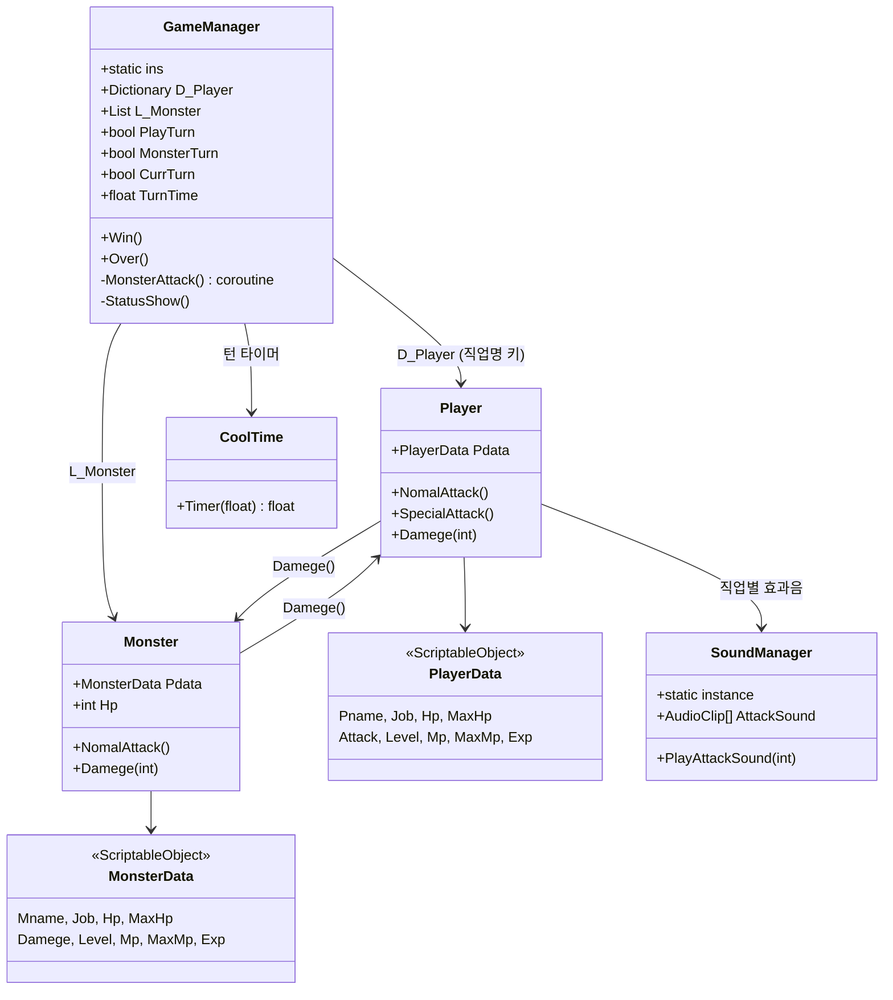
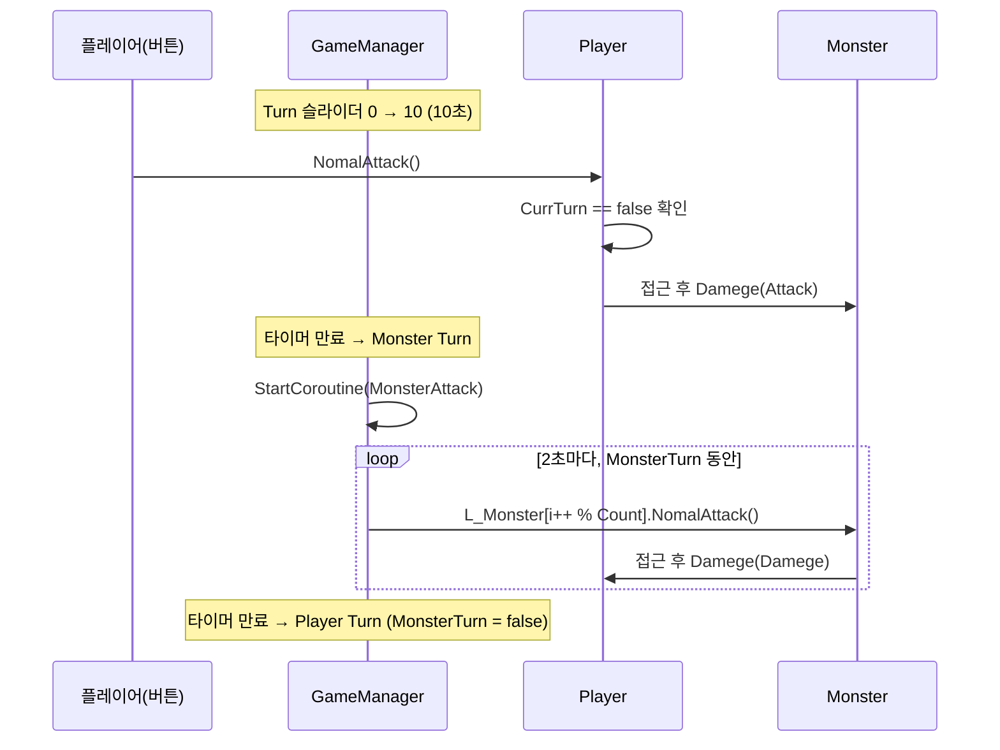

# 02. 아키텍처

## 전체 구조

싱글톤 매니저 2개(`GameManager`, `SoundManager`)가 전투 씬의 중심이고,
스탯은 `ScriptableObject`(`PlayerData` / `MonsterData`)로 분리되어 있습니다.
필드 씬은 전투 씬과 완전히 독립적인 스크립트 세트(`PlayerMovement`, `PlayerAnimation`,
`CameraController`, `TrapSpawn`, `fight`, `NPC`)로 구성됩니다.



## 턴 시스템

턴은 **행동 기반이 아니라 시간 기반**입니다. `CoolTime`이 0→`TurnTime`(기본 10초)을
반복하는 톱니파 타이머를 제공하고, `GameManager.Update()`에서 그 값이 `TurnTime`에
도달할 때마다 턴을 뒤집습니다.

```csharp
// GameManager.Update()
Turn.value = ct.Timer(TurnTime);
if (Turn.value >= TurnTime)
{
    if (PlayTurn) { TurnTxt.text = "Player Turn"; MonsterTurn = false; }
    else          { MonsterTurn = true; TurnTxt.text = "Monster Turn";
                    StartCoroutine("MonsterAttack"); }
    PlayTurn = !PlayTurn;
    CurrTurn = PlayTurn;   // false = 플레이어 턴, true = 몬스터 턴
}
```

### 상태 변수 3개의 역할

| 변수 | 의미 | 사용처 |
|---|---|---|
| `PlayTurn` | **다음에 시작할** 턴의 종류 (true=플레이어) | 턴 전환 분기 |
| `CurrTurn` | **현재** 턴 (false=플레이어, true=몬스터) | `Player`의 입력 게이트 |
| `MonsterTurn` | 몬스터 공격 코루틴의 생존 플래그 | `MonsterAttack` while 조건 |

씬에 직렬화된 초기값은 `PlayTurn = false`, `MonsterTurn = true`, `CurrTurn = false`라서
전투 시작 후 10초간은 플레이어가 행동할 수 있고, 첫 턴 전환에서 몬스터 턴으로 넘어갑니다.

### 턴 진행 시퀀스



몬스터 턴 동안 코루틴이 2초 간격으로 라운드로빈으로 몬스터를 하나씩 공격시키므로,
10초 턴에서 약 5회의 몬스터 공격이 발생합니다.

## 전투 액션 구현

`Player`와 `Monster`의 공격은 동일한 패턴을 따릅니다.

1. 대상 배열에서 `Random.Range`로 타깃 선택
2. 코루틴에서 매 프레임 `rig.MovePosition(Vector3.Lerp(...))`로 돌진
3. 거리 0.5 이하가 되면 `attack` 애니메이션 트리거 + 효과음 + 상대 `Damege()` 호출
4. `Back = true` → `Update()`에서 원래 위치(`OriPos`)로 복귀

특수 공격(`Player.SpecialAttack`)만 다릅니다. 마법진(`MagicAura`)을 깔고 2.5초 후
폭발 프리팹(`Explosion`)을 생성하는데, **대미지 계산이 없는 연출 전용**입니다.
직업이 `신관`이면 폭발 위치가 몬스터가 아니라 아군(`Player` 태그) 중 한 명으로 바뀌어
회복 연출처럼 보이게 처리합니다.

## 피격 처리의 비대칭

같은 이름의 `Damege(int)` 메서드지만 HP를 다루는 방식이 다릅니다.

```csharp
// Monster.cs — Start()에서 SO 값을 로컬 필드로 복사해서 사용
Hp = Pdata.Hp;
...
Hp -= Attack;

// Player.cs — ScriptableObject의 필드를 직접 차감
Pdata.Hp -= Attack;
```

`PlayerData`는 공유 에셋이므로 `Player`의 구현은 **에디터에서 에셋 값을 영구적으로 깎습니다.**
Play를 반복하면 체력이 누적 감소합니다. 자세한 내용과 수정 방향은
[08. 알려진 이슈](08-알려진-이슈.md#1-플레이어-hp가-scriptableobject에-영구-반영됨)에 있습니다.

사망 처리는 양쪽 모두 매니저의 컬렉션에서 자신을 제거하고 `Destroy`합니다.

```csharp
GameManager.ins.D_Player.Remove(Pdata.Job);  // Player
GameManager.ins.L_Monster.Remove(gameObject); // Monster
```

`GameManager.Update()`는 이 컬렉션의 `Count`로 승패를 판정합니다
(`D_Player.Count == 0` → GameOver, `L_Monster.Count == 0` → Win).

## 상태창 바인딩

`GameManager.Start()`에서 `Status` 태그를 가진 오브젝트 3개를 찾아
`GetComponentsInChildren<Text>()`로 텍스트 배열을 확보하고, `StatusShow()`가
인덱스 순서(`0=직업, 1=레벨, 2=경험치, 3=HP, 4=MP`)로 값을 써 넣습니다.

```csharp
Status = GameObject.FindGameObjectsWithTag("Status");
swordmanTxt = Status[0].GetComponentsInChildren<Text>();
priestTxt   = Status[1].GetComponentsInChildren<Text>();
witchTxt    = Status[2].GetComponentsInChildren<Text>();
```

`FindGameObjectsWithTag`의 반환 순서는 보장되지 않으므로 패널과 캐릭터가 어긋날 수 있습니다
([08. 알려진 이슈](08-알려진-이슈.md) 참고).

## 씬 간 상태 전달

영속 데이터는 `PlayerPrefs` 두 키뿐입니다.

| 키 | 쓰는 곳 | 읽는 곳 |
|---|---|---|
| `PlayerX` | `fight.FadeAction()` — 전투 진입 트리거 좌표 | `PlayerMovement.Start()` |
| `PlayerY` | 같음 | 같음 |

전투 결과(경험치, 남은 HP, 몬스터 제거 여부)는 전달되지 않습니다. 필드로 돌아오면
파티 상태는 초기화되고 함정도 그대로 남아 있습니다.
