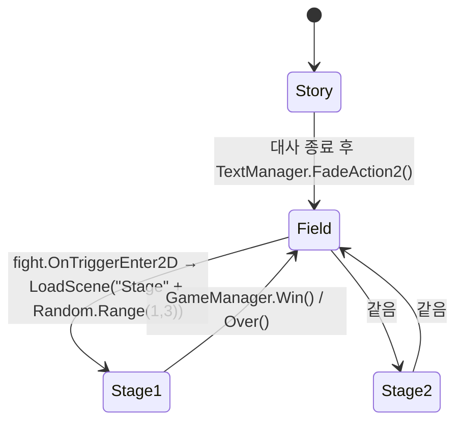

# 03. 씬 구성과 흐름

## 씬 전환 맵

`Random.Range(1, 3)`은 정수 오버로드라 상한 제외 → **1 또는 2**가 나옵니다.

## Story

인트로 대사 씬. 약 990줄.

| 오브젝트 | 구성 |
|---|---|
| `BG001` | 배경 이미지 (`CGDATA/BG001.bmp`) |
| `WITCH_01` | 대사 중 `tell` 트리거로 움직이는 마녀 일러스트 (Animator) |
| `TextManager` | `TextManager.cs` — CSV 대사 재생 |
| `Canvas / Text` | 대사 출력 (`UnityEngine.UI.Text`) |
| `Image` (Fade 프리팹) | `Fade.cs`로 알파 페이드 |

동작: `Start()`에서 `CSVReader.Read("story")`로 `Resources/story.txt`를 파싱해
`List<Dictionary<string, object>>`로 보관하고, `이름`·`대사` 컬럼을 `"이름 : 대사"` 형태로 출력.
클릭마다 다음 줄로 넘기고 더 이상 줄이 없으면 페이드 후 `Field` 로드.

## Field

탐험 씬. 약 98,000줄(타일맵 데이터 비중이 큼).

| 오브젝트 | 구성 |
|---|---|
| `witch` | 플레이어. `Player` 태그. `PlayerMovement` + `PlayerAnimation` + `Rigidbody2D` |
| `Main Camera` | `CameraController` — 플레이어 추적 + `minX/maxX/minY/maxY` 클램프 |
| `Grid / Tilemap`, `Tilemap (1)` | Isometric Nature Pack 타일로 구성한 맵 |
| `Trap1` ~ `Trap4` | `TrapSpawn` — 각각 `Fight` 프리팹 3개를 ±3 범위에 랜덤 배치 |
| `npc_01` | `NPC` — 충돌 시 대화 캔버스 on/off |
| `fade` | `Fade` 컴포넌트를 가진 오브젝트. `fight`가 이름으로 찾아 참조 |
| `st50c` | 배경 장식 스프라이트 |

전투 트리거는 총 **12개**(4 × 3)가 매 플레이마다 다른 위치에 생성됩니다.
`Fight` 프리팹은 `IsTrigger` 콜라이더 + `fight.cs`로, 시작 시 알파 0으로 투명해져
보이지 않는 함정으로 동작합니다.

## Stage1 / Stage2

턴제 전투 씬. 구조는 동일하고 **등장 몬스터와 배경만 다릅니다.**

| 항목 | Stage1 | Stage2 |
|---|---|---|
| 몬스터 | `puyo`(슬라임) × 3 | `eye`(눈괴물) × 3 |
| 배경 | `Map1` 프리팹 + `tree1` 장식 + Tilemap | `Map1` 프리팹 + `tree1` |
| 마법진 이펙트 | `CFX_Magical_Source` | `CFX3_DarkMagicAura_A`, `CFX3_MagicAura_B/D_Runic` |

공통 오브젝트:

| 오브젝트 | 역할 |
|---|---|
| `GameManager` | `Player1~3`, `Monster1~3`, `Turn` 슬라이더, `TurnTxt`, `GameOver`/`GameWin` 캔버스 참조 |
| `SoundManager` | `AudioSource` + 공격 효과음 배열 |
| swordman / priest / witch | `Resources/Player/`의 프리팹 인스턴스. 씬에서 `Player` 태그로 오버라이드 |
| `Status`, `Status (1)`, `Status (2)` | 캐릭터 상태창. 자식 Text 5개(`JobTxt`, `LevelTxt`, `ExpTxt`, `HPTxt`, `MPTxt`) |
| `P1Attack` ~ `P3Special` | 버튼 6개. `Player.NomalAttack` / `Player.SpecialAttack`에 직접 바인딩 |
| `Slider` + `TurnTxt` | 턴 게이지(Min 0 / Max 10)와 "Player Turn" / "Monster Turn" 라벨 |
| `MagicAura` ~ `MagicAura (2)` | 캐릭터별 특수 공격 마법진 생성 위치 |
| `GAMEOVER` / `WIN` 캔버스 | 비활성 상태로 시작. 버튼이 `GameManager.Over()` / `Win()` 호출 |

### 버튼 바인딩

6개 버튼은 코드가 아니라 **씬의 `onClick` 이벤트로 직접 연결**되어 있습니다.

| 버튼 | 타깃 | 메서드 |
|---|---|---|
| `P1Attack` / `P1Special` | Player1(검사) | `NomalAttack` / `SpecialAttack` |
| `P2Attack` / `P2Special` | Player2(신관) | 같음 |
| `P3Attack` / `P3Special` | Player3(마법사) | 같음 |

따라서 캐릭터를 추가·교체하려면 코드 수정과 별개로 씬의 버튼 연결을 다시 걸어야 합니다.

## SampleScene

Unity 기본 템플릿 그대로의 빈 씬(`Main Camera` + `Directional Light`). 게임에서 사용하지 않습니다.

## 외부 패키지 데모 씬

- `Assets/Isometric Nature Pack/Scene/Demo.unity`
- `Assets/JMO Assets/Cartoon FX/Demo/CFX Free Demo.unity`

에셋 번들에 포함된 데모로, 게임 흐름과 무관합니다.
