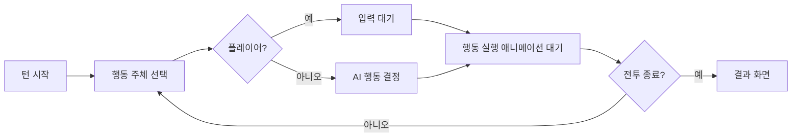

# 08. 알려진 이슈와 개선 과제

코드와 씬/설정 파일을 읽어 확인한 내용입니다. 에디터 실행으로 검증한 것이 아니므로
"**확인 필요**"로 표시한 항목은 실제 Play에서 재현 여부를 먼저 확인하세요.

> 기준 상태: Unity **6000.6.0f1**, 커밋 `359e98e` (2026-10-06).
> 이슈 3은 해결되었고 나머지는 그대로입니다.

## 우선순위 요약

| # | 이슈 | 영향 | 위치 |
|---|---|---|---|
| 1 | 플레이어 HP가 ScriptableObject에 영구 반영 | 높음 | `Player.cs:136` |
| 2 | 사망한 대상을 고르면 공격 코루틴이 무한 루프 | 높음 | `Player.cs:47`, `Monster.cs:47` |
| 3 | ~~빌드 씬 목록이 비어 있음~~ → **해결됨** (`359e98e`) | — | `EditorBuildSettings.asset` |
| 4 | 커스텀 태그가 등록되지 않음 (확인 필요) | 높음 | `TagManager.asset` |
| 5 | `TurnTime > 10`이면 턴이 전환되지 않음 | 중간 | `GameManager.cs:97` |
| 6 | 몬스터 공격 코루틴 중복 실행 가능 | 중간 | `GameManager.cs:109` |
| 7 | 상태창-캐릭터 매칭이 검색 순서에 의존 | 중간 | `GameManager.cs:81` |
| 8 | 매 프레임 로그 + 상태창 갱신 | 중간(성능) | `GameManager.cs:116,160` |
| 9 | 효과음 인덱스 하드코딩 | 낮음 | `Player.cs:71` |
| 10 | 결과 캔버스가 떠도 전투가 계속 진행 | 낮음 | `GameManager.cs:121` |

---

## 1. 플레이어 HP가 ScriptableObject에 영구 반영됨

```csharp
// Player.cs:134-136
public void Damege(int Attack)
{
    Pdata.Hp -= Attack;   // ← 공유 에셋의 필드를 직접 수정
```

`Pdata`는 `Assets/Data/swordman.asset` 같은 **공유 에셋**입니다. 에디터에서 Play를
반복하면 HP가 누적 차감되고, 에셋이 저장되는 시점에 파일 자체가 바뀝니다.
전투에 한 번 지면 다음 Play에서는 더 낮은 HP로 시작합니다.

`Monster`는 같은 문제를 올바르게 피하고 있습니다.

```csharp
// Monster.cs:34-35
Hp = Pdata.Hp;
MaxHp = Pdata.MaxHp;
```

**수정 방향** — `Player`에도 런타임 HP 필드를 두고 `Start()`에서 복사한 뒤
그 값을 차감하도록 바꿉니다. `StatusShow()`의 `P.Pdata.Hp` 참조도 함께 바꿔야 합니다.

```csharp
public int Hp, MaxHp, Mp, MaxMp, Level, Exp;   // 런타임 상태
void Start() { Hp = Pdata.Hp; MaxHp = Pdata.MaxHp; /* ... */ }
```

## 2. 사망한 대상을 선택하면 코루틴이 무한 루프

```csharp
// Player.cs:43-66
IEnumerator NomalAttackCT()
{
    int r = Random.Range(0, Monster.Length);
    while (true)
    {
        if (Monster[r] != null) { /* 돌진, 도달 시 break */ }
        yield return null;          // ← null이면 영원히 여기서 맴돈다
    }
}
```

`Monster` 배열은 `Start()`에서 한 번만 캐시되므로(`Player.cs:31`) 죽은 몬스터의
슬롯이 `null`로 남습니다. 그 슬롯이 뽑히면 `break` 조건에 도달하지 못해
코루틴이 종료되지 않습니다. 버튼을 누를 때마다 누적되어 코루틴이 계속 쌓입니다.
`Monster.cs:43-67`도 동일한 구조입니다.

**수정 방향** — 캐시 대신 매니저의 생존 컬렉션에서 타깃을 고르고, 타임아웃/널 가드를 둡니다.

```csharp
IEnumerator NomalAttackCT()
{
    var list = GameManager.ins.L_Monster;
    if (list.Count == 0) yield break;
    GameObject target = list[Random.Range(0, list.Count)];

    while (target != null) { /* 돌진 후 도달하면 break */ yield return null; }
    Back = true;
}
```

## 3. 빌드 씬 목록이 비어 있음 (해결됨)

`m_Scenes: []` 상태라 빌드본에서 모든 `SceneManager.LoadScene` 호출이 실패하던
문제입니다. 커밋 `359e98e`에서 씬 4개(`Field`, `Story`, `Stage1`, `Stage2`)가
등록되어 해소되었습니다.

남은 사항 하나 — 등록 순서상 **인덱스 0이 `Field`**라서 빌드본은 인트로를 건너뛰고
필드에서 시작합니다. 스토리부터 보여주려면 Build Settings에서 `Story.unity`를
맨 위로 올리세요. 자세한 내용은
[07. 개발 환경과 빌드](07-개발-환경과-빌드.md#1-빌드-씬-목록-등록-완료)에 있습니다.

## 4. 커스텀 태그 미등록 (확인 필요)

`TagManager.asset`의 `tags: []`인데 씬과 코드는 `Player`, `Monster`, `Status` 태그를
사용합니다. 미등록 태그로 `FindGameObjectsWithTag`를 호출하면 예외가 발생합니다.
에디터에서 Play가 잘 된다면 `TagManager.asset`이 커밋되지 않은 것이므로
태그를 추가하고 커밋하세요
([07. 개발 환경과 빌드](07-개발-환경과-빌드.md#2-태그-등록-확인-미해결) 참고).

## 5. `TurnTime`을 10보다 크게 하면 턴이 멈춤

```csharp
// GameManager.cs:97-98
Turn.value = ct.Timer(TurnTime);
if (Turn.value >= TurnTime)
```

`Turn`은 `Slider`이고 씬에 `m_MaxValue: 10`으로 설정되어 있습니다. `Slider.value`는
범위로 클램프되므로 `TurnTime = 15`로 바꾸면 `Turn.value`가 10을 넘지 못해
**턴 전환 조건이 영원히 거짓**이 됩니다.

**수정 방향** — 타이머 값을 슬라이더를 거치지 않고 로컬 변수로 판정하고,
슬라이더는 표시 전용으로 정규화합니다.

```csharp
float t = ct.Timer(TurnTime);
Turn.value = t / TurnTime;        // 슬라이더 Max = 1
if (t >= TurnTime) { /* 턴 전환 */ }
```

## 6. 몬스터 공격 코루틴 중복 실행 가능

턴 전환 판정이 `Update()`의 값 비교라서 `Turn.value >= TurnTime`이 연속 두 프레임
참이 되면 `StartCoroutine("MonsterAttack")`이 두 번 실행됩니다. `CoolTime`이
`Cooltime`을 0으로 리셋하는 시점과 누적값이 `TurnTime`에 도달하는 시점이
`deltaTime` 단위로 근접해 있어 프레임 레이트에 따라 타이밍이 달라집니다.

**수정 방향** — 전환을 "값 비교"가 아니라 "엣지"로 처리하거나, 코루틴 핸들을 보관해
중복 실행을 막습니다.

```csharp
if (monsterRoutine != null) StopCoroutine(monsterRoutine);
monsterRoutine = StartCoroutine(MonsterAttack());
```

## 7. 상태창 매칭이 검색 순서에 의존

```csharp
// GameManager.cs:81-84
Status = GameObject.FindGameObjectsWithTag("Status");
swordmanTxt = Status[0].GetComponentsInChildren<Text>();
priestTxt   = Status[1].GetComponentsInChildren<Text>();
witchTxt    = Status[2].GetComponentsInChildren<Text>();
```

`FindGameObjectsWithTag`의 반환 순서는 Unity가 보장하지 않습니다. 또한
`GetComponentsInChildren<Text>()`의 인덱스 0~4가 `직업/레벨/경험치/HP/MP`라는 가정은
하이어라키 순서에 의존하므로 패널 내부 구조를 바꾸면 조용히 깨집니다.
`Status` 태그 오브젝트가 3개 미만이면 `IndexOutOfRangeException`이 납니다.

**수정 방향** — 상태창을 `GameManager`의 인스펙터 배열로 직접 연결하고,
각 패널에 전용 컴포넌트(`StatusPanel`)를 두어 `Text` 참조를 명시적으로 보유합니다.

## 8. 매 프레임 로그와 상태창 갱신

```csharp
// GameManager.cs:116
print("CurrTurn" + CurrTurn);
// GameManager.cs:162-163
Debug.Log("플레이어" + D_Player.Count);
Debug.Log("몬스터" + L_Monster.Count);
```

프레임마다 문자열 연결 + 로그 3건이 발생해 에디터 콘솔이 가득 차고 GC 할당이 늘어납니다.
`StatusShow()`도 매 프레임 `Dictionary` 조회와 `GetComponent`, 문자열 연결 15회를 수행합니다.

**수정 방향** — 디버그 로그 제거, 상태창은 값이 변할 때만 갱신(이벤트 또는 변경 감지).

## 9. 효과음 인덱스 하드코딩

```csharp
// Player.cs:71-85
if (Pdata.Job == "검사")   SoundManager.instance.PlayAttackSound(8);
if (Pdata.Job == "신관")   SoundManager.instance.PlayAttackSound(4);
if (Pdata.Job == "마법사") SoundManager.instance.PlayAttackSound(2);
```

직업 판정이 한글 문자열 비교이고 인덱스가 매직 넘버입니다. 배열 순서가 바뀌면
소리가 어긋나고, 배열 길이가 9 미만이면 검사 공격에서 예외가 납니다.

**수정 방향** — `AudioClip attackClip`을 `PlayerData`의 필드로 옮기면
직업 분기와 인덱스가 모두 사라집니다.

## 10. 결과 캔버스가 떠도 전투가 계속 진행

```csharp
// GameManager.cs:121-125
if (D_Player.Count == 0) GameOver.SetActive(true);
if (L_Monster.Count == 0) GameWin.SetActive(true);
```

매 프레임 `SetActive(true)`를 다시 호출하고, 턴 타이머와 몬스터 코루틴은 멈추지 않습니다.
승리 후에도 타이머가 계속 돌고 "Monster Turn" 텍스트가 갱신됩니다.

**수정 방향** — 종료 플래그를 두고 한 번만 처리하며 코루틴과 타이머를 정지합니다.

---

## 미완성 기능

| 기능 | 현재 상태 |
|---|---|
| 특수 공격 대미지 | 연출만 있고 `Damege()` 호출 없음 (`Player.cs:94-114`) |
| MP 소비 | 어떤 행동도 MP를 쓰지 않음 |
| 경험치 / 레벨업 | `MonsterData.Exp`가 데이터에만 존재, 획득 로직 없음 |
| 전투 결과 영속화 | HP·경험치가 필드로 전달되지 않음. `PlayerPrefs`에는 좌표만 저장 |
| 캐릭터별 행동 제한 | 플레이어 턴 동안 버튼을 몇 번이든 누를 수 있음 |
| `HideTilemapColliderOnPlay` | 어떤 씬에도 부착되지 않음 |
| `SampleScene` | 빈 템플릿 씬 |

## 사소한 품질 항목

- **명명 일관성** — `Damege`(= Damage), `NomalAttack`(= Normal), 애니메이션 파일의
  `damege`/`demage` 혼용. 리팩터링 시 Animator 트리거 이름(`attack`, `damege`)과
  파일명을 함께 맞춰야 합니다.
- **싱글톤** — `GameManager.ins = this`를 조건 없이 대입(`GameManager.cs:53`),
  `SoundManager`는 중복 인스턴스를 파괴하지 않음. 씬 재로드 시 참조가 꼬일 수 있습니다.
- **이름 기반 참조** — `fight.cs:13`의 `GameObject.Find("fade")`는 `Field` 씬에
  `fade`라는 이름의 오브젝트가 있다는 전제에 의존합니다. 인스펙터 참조가 안전합니다.
- **문자열 코루틴** — `StartCoroutine("NomalAttackCT")` 형태는 리플렉션 기반이라
  오타가 컴파일 시점에 잡히지 않습니다. `StartCoroutine(NomalAttackCT())`를 권합니다.
- **물리 호출 위치** — `Rigidbody2D.MovePosition`을 코루틴/`Update`에서 호출합니다
  (`Player.cs:53,126`). `FixedUpdate` 타이밍이 정석이며, `Vector3.Lerp(a, b, 20*deltaTime)`은
  보간 비율에 `deltaTime`을 넣는 관용구로 프레임 레이트에 따라 속도가 달라집니다.
- **첫 실행 위치** — `PlayerMovement.Start()`가 `PlayerPrefs`를 무조건 읽으므로
  저장값이 없으면 (0,0)에서 시작합니다. `HasKey` 확인 후 기본 스폰 위치로 두는 편이 낫습니다.

## 구조 개선 제안

### 1단계 — 안정화 (동작 보장)

1. 태그 등록 (빌드 씬 목록은 `359e98e`에서 완료)
2. `Player`의 런타임 HP 분리 (이슈 1)
3. 공격 코루틴 널 가드 (이슈 2)
4. 디버그 로그 제거 (이슈 8)

### 2단계 — 하드코딩 제거

`Player1~3` / `Monster1~3` 개별 필드와 `StatusShow()`의 3중 복붙,
`Sound()`의 직업 분기를 컬렉션 기반으로 통합합니다.

```csharp
[SerializeField] List<Player> party;      // 인스펙터에서 N명
[SerializeField] List<StatusPanel> panels;

void RefreshStatus()
{
    for (int i = 0; i < party.Count; i++) panels[i].Bind(party[i]);
}
```

이렇게 하면 캐릭터 추가 시 코드 수정 없이 인스펙터 연결만으로 끝납니다.

### 3단계 — 턴 시스템 재설계

시간 기반 턴은 "플레이어가 아무 행동도 못 했는데 턴이 끝난다" / "버튼을 연타하면
무제한 공격" 두 문제를 동시에 갖습니다. 턴 큐 기반으로 바꾸면 해결됩니다.



### 4단계 — 전투 결과 영속화

파티 상태(HP/MP/Exp)를 `ScriptableObject` 런타임 컨테이너나 `DontDestroyOnLoad`
싱글톤에 담아 씬 간 전달하고, 승리한 함정은 제거 상태를 기억하게 합니다.
